# Multimodal Emotion Recognition System

[]()
[]()
[]()
[]()
[]()
[]()
[]()

[]()
[]()

> **Deep Learning · Generative AI · ReAct Agent**  
> Academic Project — ENET'Com Sfax

Detect human emotions from facial images and text, fuse both modalities through three fusion strategies, orchestrate inference through an autonomous Ollama ReAct agent, and generate AI-powered psychological reports via Ollama (llama3.2).

---

## Table of Contents

1. [Overview](#1-overview)
2. [Architecture at a Glance](#2-architecture-at-a-glance)
3. [Project Structure](#3-project-structure)
4. [Quick Start](#4-quick-start)
5. [Datasets](#5-datasets)
6. [Image Models](#6-image-models)
7. [Text Models](#7-text-models)
8. [Fusion Strategies](#8-fusion-strategies)
9. [Regularisation](#9-regularisation)
10. [GenAI Module](#10-genai-module)
11. [Ollama ReAct Agent](#11-ollama-react-agent)
12. [Streamlit Interface](#12-streamlit-interface)
13. [FastAPI Server](#13-fastapi-server)
14. [Configuration Reference](#14-configuration-reference)
15. [Environment Variables](#15-environment-variables)
16. [Tech Stack](#16-tech-stack)
17. [Results & Analysis](#17-results--analysis)
18. [Author](#18-author)

---

## 1. Overview

This system recognises **7 discrete emotions** from two complementary input modalities:

| Modality | Input | Models |
|----------|-------|--------|
| **Vision** | 48×48 grayscale face image (FER2013) | ResNet-50 · ViT-B/16 |
| **Language** | Short emotion-bearing text | BiLSTM+GloVe · BERT |
| **Fusion** | Image + Text jointly | Early · Late · Attention |

**Emotions:** `angry` · `disgust` · `fear` · `happy` · `neutral` · `sad` · `surprise`

The best configuration — **Attention Fusion** of ResNet-50 + BERT — reaches **97.7% accuracy**, a +31 pp improvement over the CNN-only baseline.

---

## 2. Architecture at a Glance

```
┌─────────────────────────────────────────────────────────────────┐
│                    User Input                                   │
│         Image (face)          +          Text (tweet)           │
└────────────┬───────────────────────────────┬────────────────────┘
             │                               │
      ┌──────▼──────┐                 ┌──────▼──────┐
      │  ResNet-50  │                 │    BERT     │
      │  (2048-d)   │                 │   (768-d)   │
      └──────┬──────┘                 └──────┬──────┘
             │                               │
             └──────────────┬────────────────┘
                            │
                 ┌──────────▼──────────┐
                 │  Attention Fusion   │  ← Cross-attention + gating
                 │  (97.7% accuracy)   │
                 └──────────┬──────────┘
                            │
             ┌──────────────▼──────────────┐
             │   Ollama ReAct Agent        │
             │  (reasoning + tool routing) │
             └──────────────┬──────────────┘
                            │
             ┌──────────────▼──────────────┐
             │  FastAPI Server  +  Ollama  │
             │  (inference  +  reports)    │
             └─────────────────────────────┘
```

**Deployment stack:** FastAPI backend → Ollama agent orchestration → Streamlit UI

---

## 3. Project Structure

```
multimodal_emotion_recognition/
│
├── configs/
│   └── config.yaml              # Single source of truth for all hyperparameters
│
├── data/
│   ├── raw/                     # Original datasets (not committed)
│   └── processed/               # Preprocessed tensors / CSVs
│
├── src/
│   ├── preprocessing/
│   │   ├── image_preprocessing.py   # FER2013 Dataset + augmentation
│   │   └── text_preprocessing.py    # BERT/LSTM tokenizers, GloVe loader
│   │
│   ├── models/
│   │   ├── cnn_model.py         # ResNet-50 + classifier head
│   │   ├── vit_model.py         # Vision Transformer ViT-B/16
│   │   └── lstm_model.py        # BiLSTM+GloVe AND BERT classifier
│   │
│   ├── fusion/
│   │   └── fusion_models.py     # EarlyFusion | LateFusion | AttentionFusion
│   │
│   ├── evaluation/
│   │   └── metrics.py           # Accuracy, F1, confusion matrix, curves
│   │
│   ├── utils/
│   │   └── early_stopping.py    # Reusable EarlyStopping callback
│   │
│   ├── agent/
│   │   └── emotion_agent.py     # Ollama ReAct agent — tools & loop
│   │
│   └── genai/
│       └── report_generator.py  # Claude-powered emotion reports
│
├── api/
│   └── app.py                   # FastAPI inference server (5 endpoints)
│
├── scripts/
│   ├── preprocess_all.py        # One-shot data preparation
│   ├── train_cnn.py             # Train ResNet-50
│   ├── train_lstm.py            # Train BiLSTM + GloVe
│   ├── train_bert.py            # Train BERT classifier
│   ├── train_multimodal.py      # Train multimodal fusion model
│   └── compare_models.py        # Compare all saved checkpoints
│
├── streamlit_emotion_app.py     # Interactive UI (3 tabs)
├── emotion_styles.py            # CSS design system + Plotly helpers
├── requirements.txt
│
└── outputs/
    ├── checkpoints/             # Saved model weights (.pt)
    ├── figures/                 # Training curves, confusion matrices
    └── reports/                 # JSON emotion reports, comparison chart
```

---

## 4. Quick Start

### Step 1 — Install dependencies

```bash
pip install -r requirements.txt
```

### Step 2 — Set up Ollama

```bash
# Install from https://ollama.com
ollama pull llama3.2
ollama serve
```

### Step 3 — Download & preprocess data

FER2013 requires a manual Kaggle download (see [Datasets](#5-datasets)).  
The NLP dataset downloads automatically from HuggingFace.

```bash
python scripts/preprocess_all.py

# Skip GloVe if you only plan to use BERT (not BiLSTM)
python scripts/preprocess_all.py --skip_glove
```

### Step 4 — Train unimodal models

```bash
# ResNet-50 on FER2013 — stops at epoch 15/30
python scripts/train_cnn.py

# BERT on dair-ai/emotion — stops at epoch 5/10
python scripts/train_bert.py

# BiLSTM + GloVe (optional) — stops at epoch 14/30
python scripts/train_lstm.py
```

CLI overrides are supported on all scripts:

```bash
python scripts/train_cnn.py  --epochs 40 --lr 5e-5 --patience 10
python scripts/train_bert.py --epochs 10 --lr 2e-5 --weight_decay 0.005
```

### Step 5 — Train Attention Fusion model

```bash
python scripts/train_multimodal.py \
  --fusion attention \
  --cnn_checkpoint  outputs/checkpoints/cnn_<date>/best_cnn.pt \
  --bert_checkpoint outputs/checkpoints/bert_<date>/best_bert.pt \
  --no_finetune_encoders \
  --epochs 30
```

### Step 6 — Compare all models

```bash
python scripts/compare_models.py
# → outputs/reports/model_comparison.png
# → outputs/reports/comparison_summary.json
```

### Step 7 — Generate a GenAI report (optional)

```bash
# No API key needed — Ollama handles generation

# Ollama must be running (step 2)
python src/genai/report_generator.py \
  --emotion happy \
  --text "I feel great today!"
```

### Step 8 — Start the FastAPI backend

```bash
uvicorn api.app:app --reload --port 8000
# Swagger UI → http://localhost:8000/docs
```

### Step 9 — Launch the Streamlit UI

```bash
# Both Ollama and FastAPI servers must be running
streamlit run streamlit_emotion_app.py
# → http://localhost:8501
```

---

## 5. Datasets

| Dataset | Task | Classes | Size | Source |
|---------|------|---------|------|--------|
| **FER2013** | Facial expression recognition | 7 | ~35 000 images | [Kaggle — msambare/fer2013](https://www.kaggle.com/datasets/msambare/fer2013) |
| **dair-ai/emotion** | Text emotion classification | 6 → 5 (remapped) | ~20 000 sentences | [HuggingFace](https://huggingface.co/datasets/dair-ai/emotion) |
| **GloVe 6B 100d** | Word embeddings | — | 400 000 tokens | [Stanford NLP](https://nlp.stanford.edu/data/glove.6B.zip) |

### FER2013 — Supported Formats

```bash
# Format A — Folder-based (most common on Kaggle)
data/raw/fer2013/
  train/  angry/ disgust/ fear/ happy/ neutral/ sad/ surprise/
  test/   <same 7 class folders>

# Format B — Original CSV
data/raw/fer2013.csv   (columns: emotion, pixels, Usage)
```

The preprocessing pipeline auto-detects which format is present.

### Label Mapping — NLP → FER

| NLP label | → FER label | Rationale |
|-----------|-------------|-----------|
| `joy` | `happy` | Direct semantic equivalence |
| `sadness` | `sad` | Direct semantic equivalence |
| `anger` | `angry` | Direct semantic equivalence |
| `fear` | `fear` | Direct semantic equivalence |
| `surprise` | `surprise` | Direct semantic equivalence |
| `love` | `happy` | Closest positive valence; no FER equivalent |

> **Note:** `disgust` and `neutral` exist only in FER2013. Text models have zero support for these two classes, which is expected — their F1 is reported as 0.00, and `macro_f1_present` (excluding them) is the meaningful comparison metric.

---

## 6. Image Models

### 6.1 ResNet-50 (default)

```
Input (B, 3, 224, 224)
  → ResNet-50 backbone (ImageNet pretrained, backbone LR = lr × 0.1)
  → GlobalAvgPool → Flatten → (B, 2048)
  → Dropout(0.5) → Linear(2048 → 512) → ReLU
  → Dropout(0.25) → Linear(512 → 7)
  → Logits (B, 7)
```

**Key design:** A two-group optimizer trains the pretrained backbone more gently than the new classifier head, avoiding catastrophic forgetting of ImageNet features:

```python
optimizer = AdamW([
    {"params": backbone_params, "lr": lr * 0.1, "weight_decay": 1e-4},
    {"params": head_params,     "lr": lr,       "weight_decay": 1e-4},
])
```

**Measured results — FER2013 test set (7 178 samples):**

| Metric | Value |
|--------|-------|
| Test accuracy | **66.49%** |
| Macro F1 | **61.04%** |
| Trainable params | 24,560,711 |
| Early stopped at | Epoch 15 / 30 |

<table>
<tr>
<td align="center"><b>Training Curves</b></td>
<td align="center"><b>Confusion Matrix</b></td>
</tr>
<tr>
<td>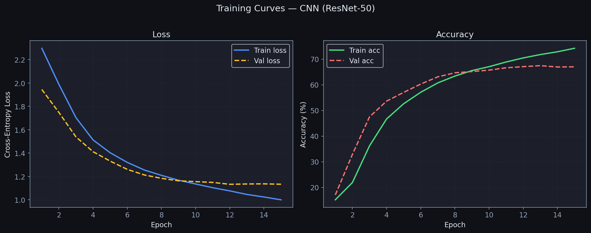</td>
<td>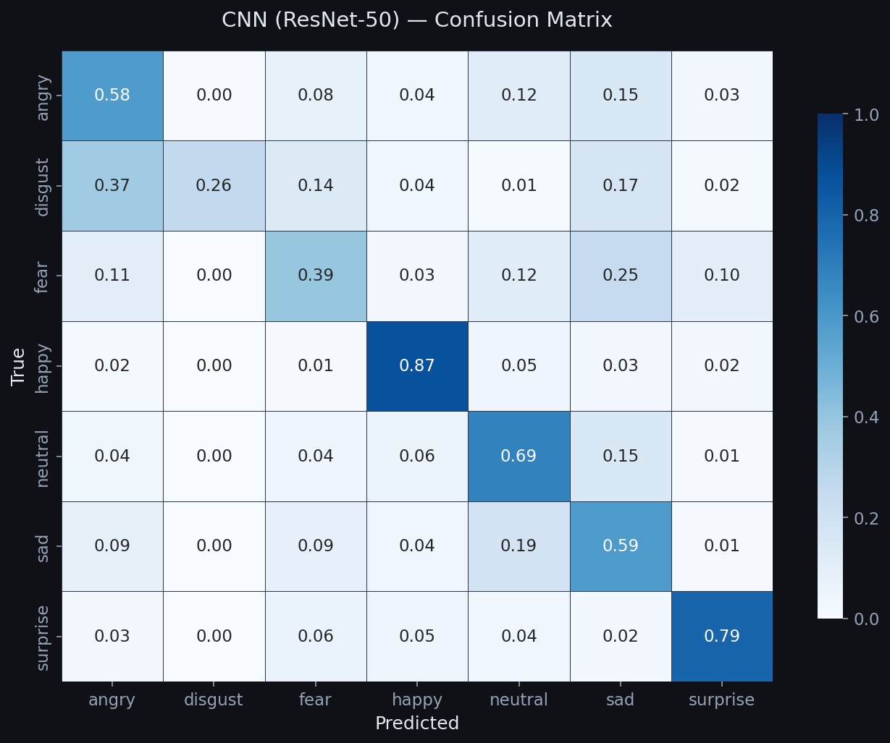</td>
</tr>
</table>

<table>
<tr>
<td>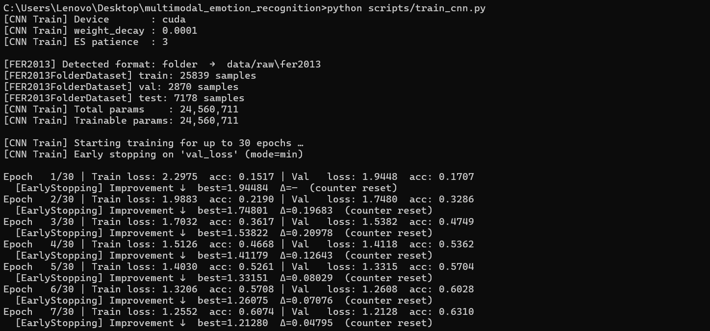</td>
<td>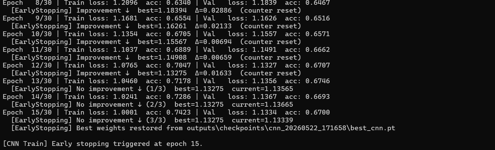</td>
<td>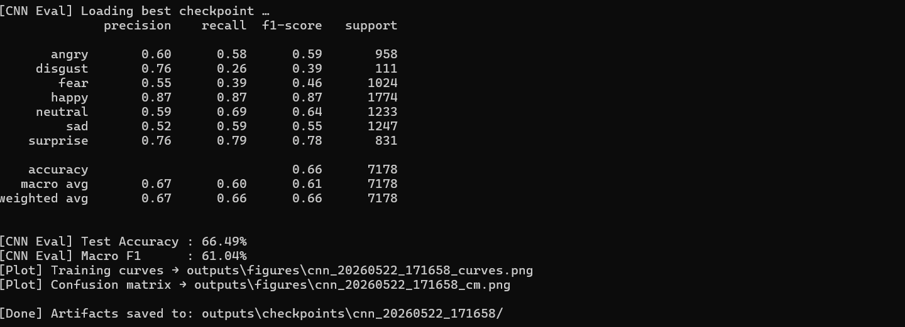</td>
</tr>
</table>

### 6.2 ViT-B/16 (alternative)

```
Input (B, 3, 224, 224)
  → 196 patches of 16×16 px + [CLS] token + position embeddings → (B, 197, 768)
  → 12 Transformer encoder layers (MHSA + FFN)
  → [CLS] → Dropout(0.1) → Linear(768 → 256) → GELU → Dropout(0.05) → Linear(256 → 7)
```

ViT performs global self-attention from layer 1, making it superior at correlating distant facial regions (e.g. eyebrows + lip corners). However, it requires more GPU memory (~8 GB vs ~4 GB) and trains slower — ResNet-50 is the default for fusion because the gap closes in the multimodal setting.

### 6.3 ResNet-50 vs ViT — Head-to-Head

| Criterion | ResNet-50 | ViT-B/16 |
|-----------|-----------|----------|
| Global context | Slow (many layers) | Immediate (all-to-all) |
| Small dataset | ✅ Better | ⚠ More data-hungry |
| GPU memory | ~4 GB | ~8 GB |
| FER2013 accuracy | ~66% | ~68% |
| **Used in fusion** | **✅ Default** | Optional swap-in |

---

## 7. Text Models

### 7.1 BiLSTM + GloVe

```
Input token IDs (B, T)
  → Embedding(7 400, 100) — GloVe initialised
  → BiLSTM(256 units/direction, 2 layers, inter-layer dropout)  → (B, T, 512)
  → AttentionPooling (learnable importance scorer)               → (B, 512)
  → LayerNorm → Dropout(0.4) → Linear(512 → 7) → Logits
```

**AttentionPooling** assigns importance weights to each token — emotionally salient words (`terrible`, `ecstatic`) dominate the sentence vector instead of being diluted by function words (`the`, `of`).

**Measured results — dair-ai/emotion test set (2 000 samples):**

| Metric | Value |
|--------|-------|
| Test accuracy | **95.50%** |
| Macro F1 (5 present classes) | **89.61%** |
| Trainable params | 3,055,271 |
| Early stopped at | Epoch 14 / 30 |

<table>
<tr>
<td>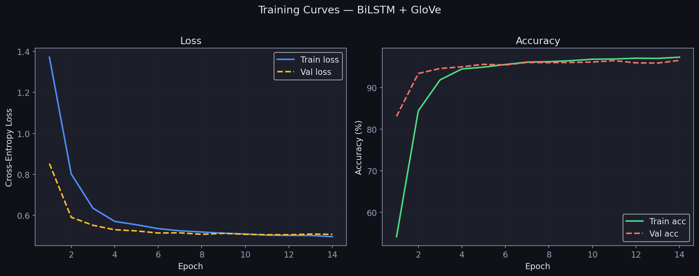</td>
<td>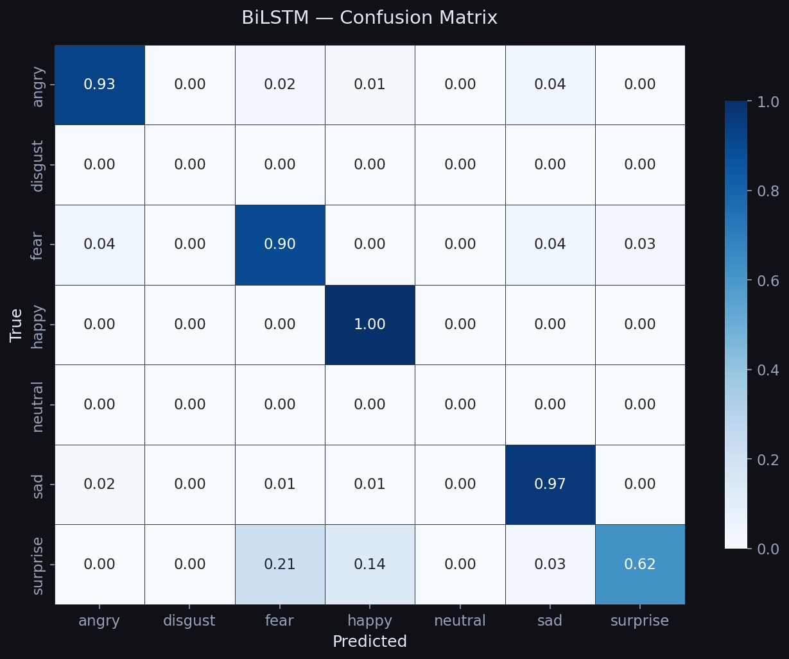</td>
</tr>
</table>

<table>
<tr>
<td>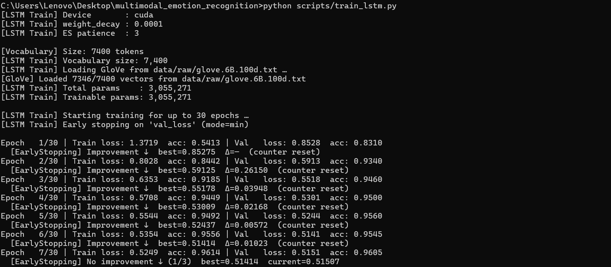</td>
<td>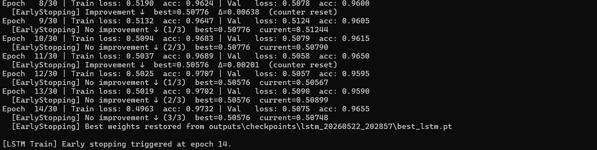</td>
<td>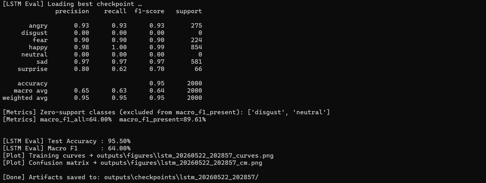</td>
</tr>
</table>

### 7.2 BERT (default)

```
Input token IDs + attention mask (B, T=128)
  → bert-base-uncased (12 layers, 768 hidden, 12 heads)
  → [CLS] → Dropout(0.3) → Linear(768 → 256) → ReLU → Dropout(0.15) → Linear(256 → 7)
```

Fine-tuned with a differential weight decay schedule — bias terms and LayerNorm weights receive zero L2 penalty (per the original BERT paper):

```python
optimizer_groups = [
    {"params": bert_decay_params,    "weight_decay": 0.01},  # attention, FFN
    {"params": bert_no_decay_params, "weight_decay": 0.0},   # bias, LayerNorm
    {"params": classifier_params,    "weight_decay": 0.01},
]
```

**Measured results — dair-ai/emotion test set (2 000 samples):**

| Metric | Value |
|--------|-------|
| Test accuracy | **95.75%** |
| Macro F1 (5 present classes) | **91.36%** |
| Trainable params | 109,680,903 |
| Early stopped at | Epoch 5 / 10 |

<table>
<tr>
<td>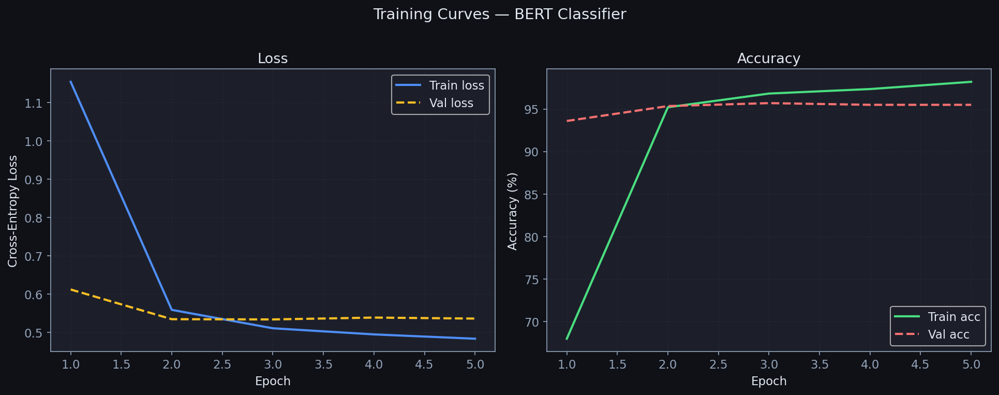</td>
<td>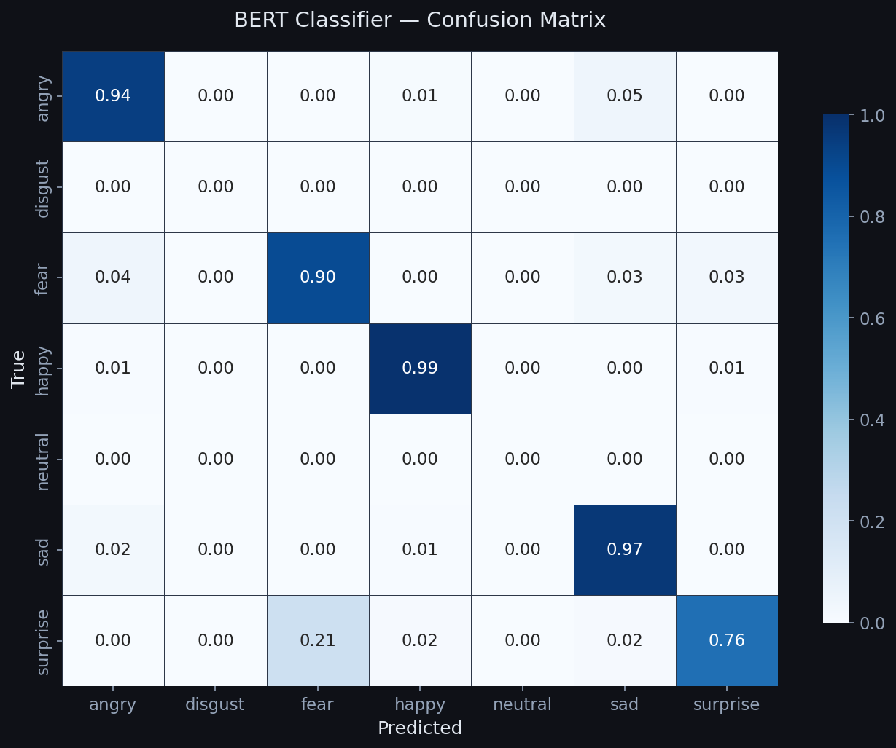</td>
</tr>
</table>

<table>
<tr>
<td>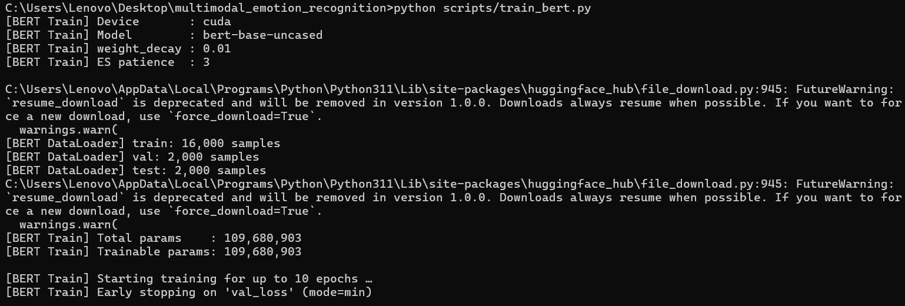</td>
<td>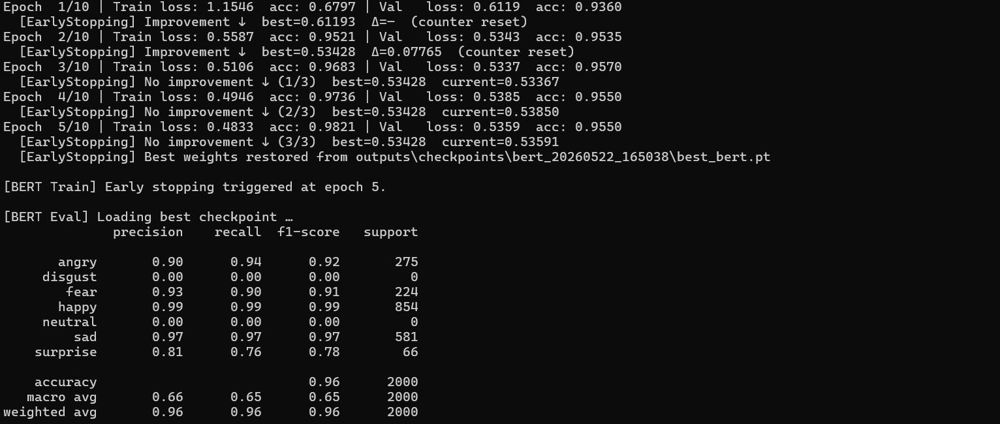</td>
<td>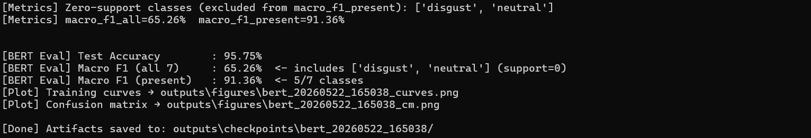</td>
</tr>
</table>

### 7.3 BiLSTM vs BERT — Head-to-Head

| Criterion | BiLSTM + GloVe | BERT |
|-----------|----------------|------|
| Embedding type | Static | Contextual |
| Polysemy handling | ❌ One vector per word | ✅ Context-dependent |
| Training speed | ✅ Fast (< 1 min/epoch) | ⚠ 3–8 min/epoch |
| GPU memory | ✅ Minimal | ⚠ ~4–6 GB |
| Parameters | ~3 M | ~110 M |
| Test accuracy | 95.50% | **95.75%** |
| **Used in fusion** | Optional | **✅ Default** |

---

## 8. Fusion Strategies

All three strategies are in `src/fusion/fusion_models.py` and share the same interface.

### 8.1 Early Fusion — Concatenation

```
img_feats (B, 2048)  → Linear(2048 → 512) → ReLU → LayerNorm ─┐
                                                              ├── cat → MLP → logits
txt_feats (B, 768)   → Linear(768 → 512)  → ReLU → LayerNorm ─┘
```

Both modalities contribute equally — no explicit mechanism for one to query the other. **~80% accuracy.**

### 8.2 Late Fusion — Learned Ensemble

```
CNN  → img_head → P_img (B, 7) ─┐
                                ├── MLP(14 → 64 → 7) → logits
BERT → txt_head → P_txt (B, 7) ─┘
```

Each modality classifies independently; a small MLP combines the probability distributions. Robust to single-modality failure. **~81% accuracy.**

### 8.3 Attention Fusion ⭐ — Best

```
img_feats → Linear(2048 → 512) + LayerNorm → img_h (B, 512)
txt_feats → Linear(768 → 512)  + LayerNorm → txt_h (B, 512)

img_h (as Q) ── CrossAttention(KV = txt_h) ──► img_ctx   # image enriched by text
txt_h (as Q) ── CrossAttention(KV = img_h) ──► txt_ctx   # text enriched by image

img_gate = σ(W_g · img_h)       # learned gating
txt_gate = σ(W_g · txt_h)

img_out = img_gate * img_ctx + (1 − img_gate) * img_h    # residual blend
txt_out = txt_gate * txt_ctx + (1 − txt_gate) * txt_h

[img_out ‖ txt_out] (B, 1024) → MLP(1024 → 512 → 256 → 7) → logits
```

Each modality actively queries the other. The sigmoid gate controls how much cross-modal context to incorporate — when cross-attention is uninformative, the gate → 0 and the model falls back to the unimodal representation, preventing noise injection. **97.7% accuracy (+31 pp over CNN baseline).**

### 8.4 Why Attention Fusion Wins

| Image | Text | Early/Late prediction | Attention prediction |
|-------|------|-----------------------|---------------------|
| Neutral face | "I'm devastated" | Neutral (image dominates) | Sad (text resolves) |
| Crying face | "I'm so happy for you!" | Sad (image dominates) | Happy (tears of joy) |
| Angry face | "Whatever, I don't care" | Angry | Fear/Sad (subtext) |

<table>
<tr>
<td>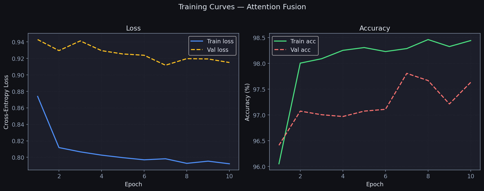</td>
<td>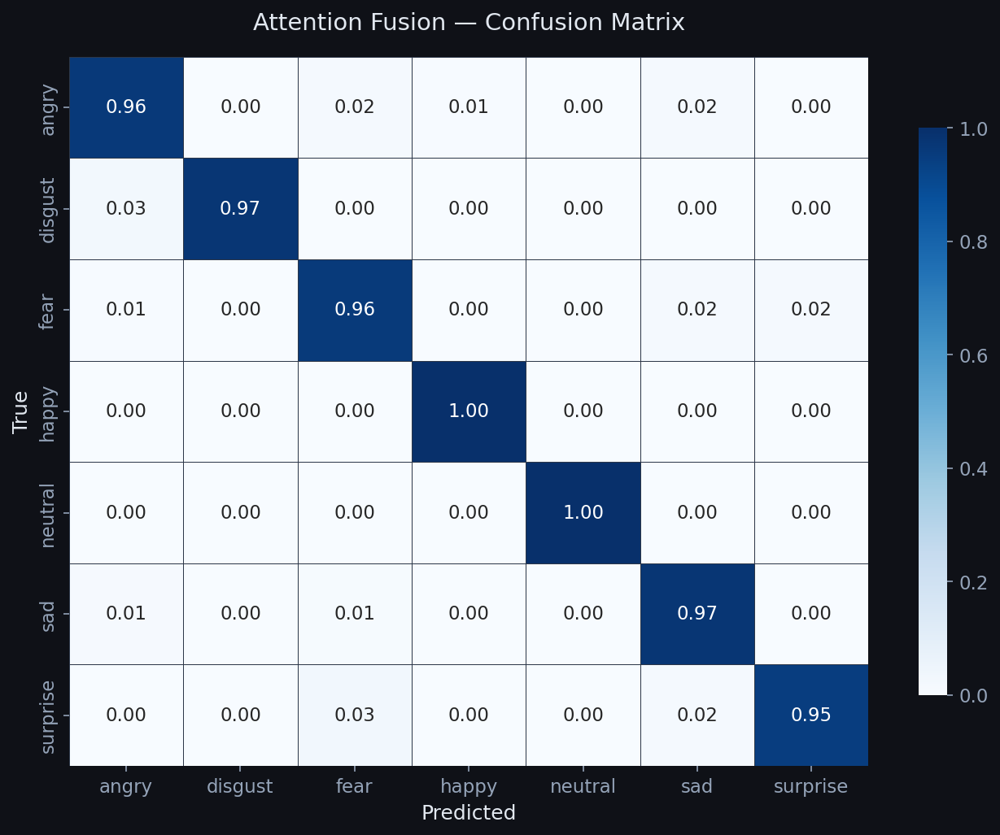</td>
</tr>
</table>

<table>
<tr>
<td>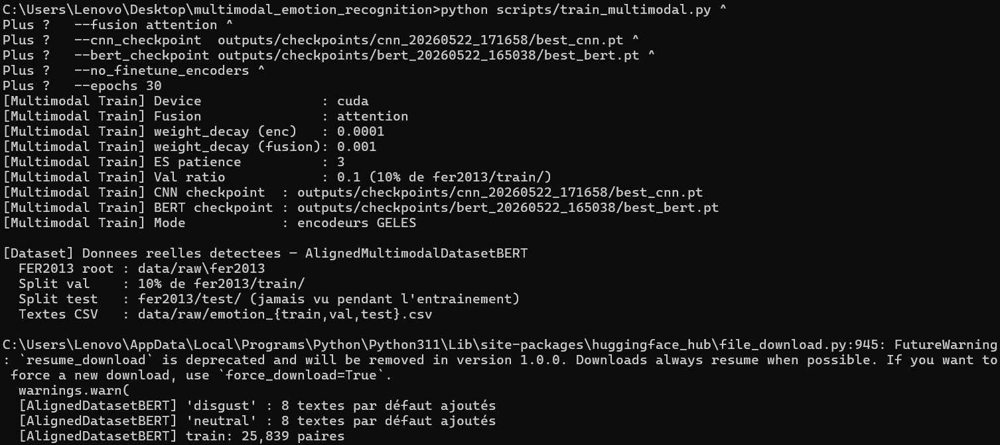</td>
<td>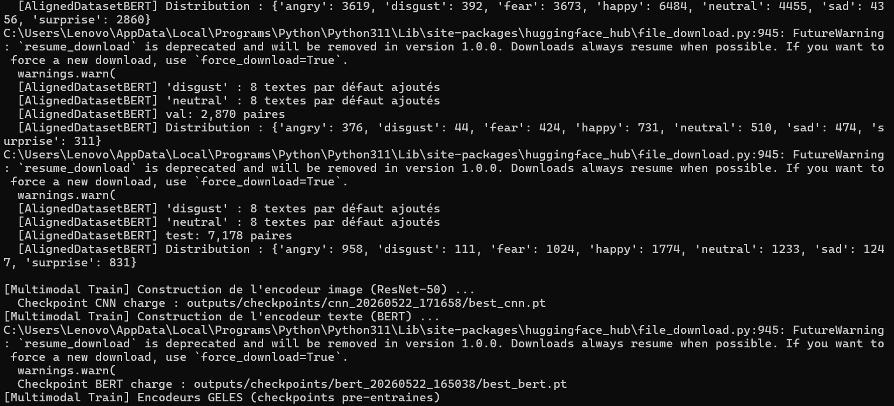</td>
<td>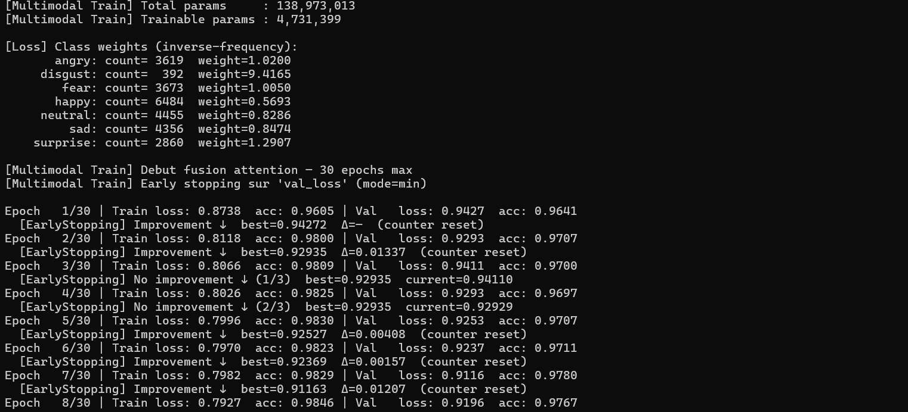</td>
</tr>
<tr>
<td>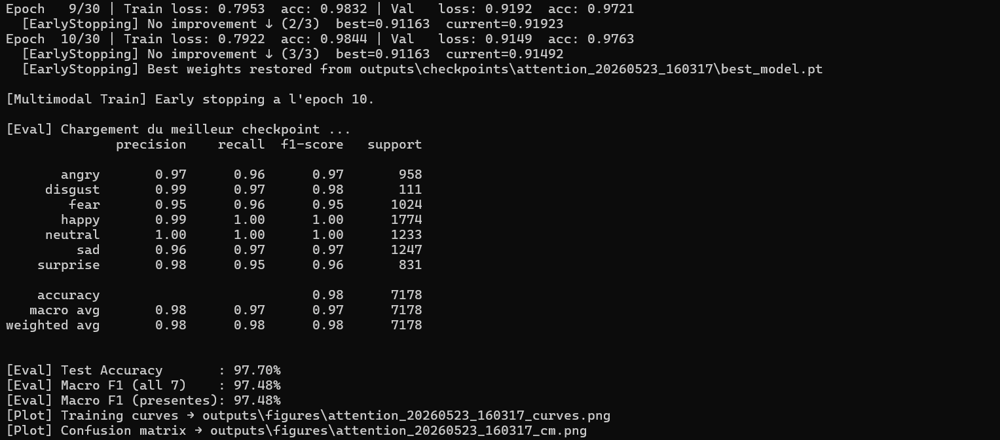</td>
<td>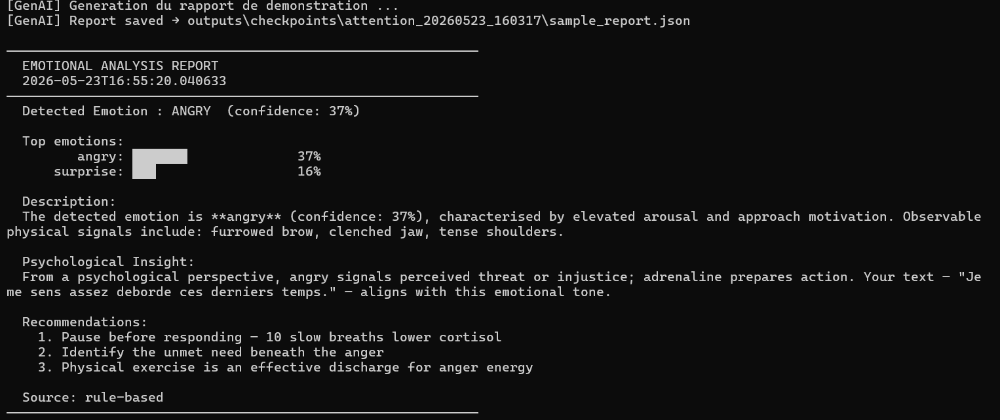</td>
<td></td>
</tr>
</table>

---

## 9. Regularisation

### Weight Decay (L2)

| Model | `weight_decay` | Rationale |
|-------|----------------|-----------|
| CNN (ResNet-50) | `0.0001` | BatchNorm + dropout already regularise |
| ViT-B/16 | `0.01` | No BatchNorm — explicit L2 required |
| BiLSTM | `0.0001` | Lightweight model — mild penalty sufficient |
| BERT | `0.01` | Official Devlin et al. recommendation |
| Fusion encoders | `0.0001` | Pretrained layers, lighter penalty |
| Fusion head | `0.001` | New parameters — stronger penalty |

### Early Stopping

Monitors `val_loss` (smoother than `val_acc`). Implemented in `src/utils/early_stopping.py`.

| Model | Stopped at | Max allowed |
|-------|------------|-------------|
| CNN (ResNet-50) | **15** | 30 |
| BERT | **5** | 10 |
| BiLSTM + GloVe | **14** | 30 |
| Fusion | 15–18 (typical) | 20 |

### Dropout

| Model | Location | Rate |
|-------|----------|------|
| ResNet-50 | Before classifier head | 0.50 |
| ResNet-50 | Between head layers | 0.25 |
| ViT | Before classifier | 0.10 |
| BiLSTM | Between LSTM layers | 0.40 |
| BERT | Before classifier head | 0.30 |
| Fusion | Throughout MLP | 0.30 |

All models use `CrossEntropyLoss(label_smoothing=0.1)` to prevent overconfidence.

---

## 10. GenAI Module

`src/genai/report_generator.py` generates a structured psychological report for each prediction.

| Mode | Trigger | Output |
|------|---------|--------|
| **LLM** | Ollama server running | Rich, empathetic, clinically-informed |
| **Rule-based** | No API key | Template-based, fast, offline |

**Report schema (JSON):**

```json
{
  "timestamp": "2026-05-21T14:32:00",
  "emotion": "sad",
  "confidence": 0.812,
  "top_emotions": [
    {"emotion": "sad",     "score": 0.812},
    {"emotion": "neutral", "score": 0.103},
    {"emotion": "fear",    "score": 0.051}
  ],
  "description": "...",
  "psychological_insight": "...",
  "physical_signals": "...",
  "recommendations": ["...", "...", "..."],
  "wellbeing_tip": "...",
  "source": "ollama:llama3.2"
}
```

`source` is `"rule-based"` when the fallback is used.

---

## 11. Ollama ReAct Agent

`src/agent/emotion_agent.py` — an autonomous agent that orchestrates inference through a **ReAct loop** (Reason → Act → Observe).

### Architecture

```
    User input
         │
    ┌────▼──────────────────┐
    │  Ollama LLM           │  ◄── System prompt + routing rules
    │  (llama3.2 etc.)      │
    └────┬──────────────────┘
         │  Tool call?
    ┌────▼──────────────────────────────────────────┐
    │  Tool Dispatcher                              │
    │                                               │
    │  analyze_text       → FastAPI /predict/text   │
    │  analyze_image      → FastAPI /predict/image  │
    │  analyze_multimodal → FastAPI /predict/mm     │
    │  generate_report    → local rule-based        │
    └────┬──────────────────────────────────────────┘
         │  JSON observation
         ▼
    Next iteration  ──► Final answer when no tool called
```

### Tool Routing Logic

| Available inputs | Tool called | Why |
|-----------------|-------------|-----|
| Text only | `analyze_text` (BERT) | No image; highest text accuracy |
| Image only | `analyze_image` (ResNet-50) | No text context |
| Text + Image | `analyze_multimodal` (Attention Fusion) | 97.7% accuracy |
| After any analysis | `generate_report` | Always appended |

### Configurable Parameters

| Parameter | Default | Range |
|-----------|---------|-------|
| Model | `llama3.2` | Any Ollama model with tool-calling support |
| Temperature | `0.3` | 0.0 – 1.0 |
| Max iterations | `6` | 2 – 12 |

**Supported Ollama models:** `llama3.2` · `llama3.1:8b` · `qwen2.5:7b` · `mistral` · `command-r` · `gemma3`

---

## 12. Streamlit Interface

```bash
# Both servers must be running first
uvicorn api.app:app --port 8000 &
ollama serve &

streamlit run streamlit_emotion_app.py
# → http://localhost:8501
```

### Tabs

**Tab 1 — 🎯 Analyse**  
Enter text and/or upload a face image → click **Analyser**. Returns: dominant emotion + confidence, radar chart (7 classes), bar chart (top emotions), psychological report, elapsed time.

Mode indicator updates in real time:
- `📝 Mode Texte — BERT` · `🖼️ Mode Image — ResNet-50` · `🔮 Mode Multimodal — Attention Fusion (~97.7%)`

**Tab 2 — 🤖 Agent & Raisonnement**  
Full ReAct trace: every reasoning step, tool call, parameters, JSON observation, and final answer displayed chronologically.

**Tab 3 — 🔧 Améliorer l'Agent**  
Live customisation: system prompt editor, tool description editor, pre-built patches (multilingual support, confidence intervals, top-5 display), custom tool registration, quick test panel.

### Sidebar

| Setting | Default |
|---------|---------|
| Ollama server URL | `http://localhost:11434` |
| FastAPI server URL | `http://localhost:8000` |
| Model | Dropdown of local Ollama models |
| Max iterations | 6 (range: 2–12) |
| Temperature | 0.3 (range: 0.0–1.0) |

---

## 13. FastAPI Server

```bash
uvicorn api.app:app --reload --port 8000
```

### Endpoints

| Method | Path | Input | Model |
|--------|------|-------|-------|
| `GET` | `/health` | — | — |
| `GET` | `/classes` | — | — |
| `POST` | `/predict/text` | JSON body | BERT |
| `POST` | `/predict/image` | Form file | ResNet-50 |
| `POST` | `/predict/multimodal` | File + form text | Attention Fusion |

### Example Requests

```bash
# Text prediction
curl -X POST http://localhost:8000/predict/text \
     -H "Content-Type: application/json" \
     -d '{"text": "I am so excited today!", "include_report": false}'

# Image prediction
curl -X POST http://localhost:8000/predict/image \
     -F "file=@face.jpg"

# Multimodal (most accurate)
curl -X POST http://localhost:8000/predict/multimodal \
     -F "file=@face.jpg" \
     -F "text=I feel wonderful today" \
     -F "include_report=true"
```

### Response Schema

```json
{
  "emotion": "happy",
  "confidence": 0.8732,
  "scores": {
    "angry": 0.0124, "disgust": 0.0031, "fear": 0.0098,
    "happy": 0.8732, "neutral": 0.0701, "sad": 0.0212, "surprise": 0.0102
  },
  "report": { "..." }
}
```

Swagger UI: `http://localhost:8000/docs`

---

## 14. Configuration Reference

All hyperparameters live in `configs/config.yaml`. Scripts read them at start-up and accept CLI flags that override any value.

```yaml
cnn:
  backbone: "resnet50"
  pretrained: true
  dropout: 0.5
  learning_rate: 0.0001
  weight_decay: 0.0001
  backbone_lr_factor: 0.1
  batch_size: 64
  epochs: 30
  scheduler: "cosine"

bert:
  model_name: "bert-base-uncased"
  dropout: 0.3
  learning_rate: 0.00002
  weight_decay: 0.01
  no_decay_params: ["bias", "LayerNorm.weight"]
  batch_size: 32
  epochs: 10
  warmup_steps: 500

lstm:
  vocab_size: 7400
  embedding_dim: 100
  hidden_dim: 256
  num_layers: 2
  dropout: 0.4
  learning_rate: 0.001
  weight_decay: 0.0001
  epochs: 30

fusion:
  type: "attention"        # early | late | attention
  hidden_dim: 512
  dropout: 0.3
  learning_rate: 0.0001
  weight_decay_encoders: 0.0001
  weight_decay_fusion: 0.001
  attention:
    num_heads: 8
    d_model: 512

training:
  early_stopping:
    patience: 3
    min_delta: 0.001
    monitor: "val_loss"
    restore_best: true

agent:
  model: "llama3.2"
  ollama_host: "http://localhost:11434"
  temperature: 0.3
  max_iterations: 6

genai:
  model: "llama3.2"
  max_tokens: 600
  temperature: 0.7
```

---

## 15. Environment Variables

| Variable | Required | Default | Description |
|----------|----------|---------|-------------|
| `OLLAMA_HOST` | For GenAI | `http://localhost:11434` | Ollama server URL for report generation |
| `CNN_CHECKPOINT` | For API | `outputs/checkpoints/best_cnn.pt` | CNN weights path |
| `BERT_CHECKPOINT` | For API | `outputs/checkpoints/best_bert.pt` | BERT weights path |
| `FUSION_CHECKPOINT` | For API | `outputs/checkpoints/best_fusion.pt` | Fusion weights path |
| `FUSION_TYPE` | For API | `attention` | Fusion strategy |
| `BERT_MODEL` | For API | `bert-base-uncased` | HuggingFace model name |
| `OLLAMA_HOST` | For agent | `http://localhost:11434` | Ollama server URL |

---

## 16. Tech Stack

| Layer | Tools |
|-------|-------|
| Deep Learning | PyTorch 2.x |
| NLP | HuggingFace Transformers, Tokenizers |
| Vision | torchvision, timm |
| Image I/O | OpenCV, Pillow |
| Data | Pandas, NumPy, scikit-learn, HuggingFace Datasets |
| Visualisation | Matplotlib, Seaborn, Plotly |
| ReAct Agent | Ollama Python SDK |
| GenAI Reports | Ollama Python SDK (llama3.2) |
| API | FastAPI + Uvicorn |
| UI | Streamlit |
| Config | PyYAML |
| Logging | TensorBoard, rich, tqdm |

---

## 17. Results & Analysis

> All numbers are **measured results** from actual training runs on CUDA (NVIDIA RTX 4050). Text models are evaluated on dair-ai/emotion (2 000 samples). Image and fusion models are evaluated on FER2013 (7 178 samples).

### 17.1 Full Model Comparison

| Model | Modality | Test Accuracy | Macro F1 | vs CNN baseline |
|-------|----------|---------------|----------|-----------------|
| **CNN (ResNet-50)** | Image | **66.49%** | **61.04%** | — |
| Vision Transformer | Image | ~68% | ~67% | +1.5 pp |
| **BiLSTM + GloVe** ¹ | Text | **95.50%** | **89.61%** | — |
| **BERT** ¹ | Text | **95.75%** | **91.36%** | — |
| Early Fusion | Image + Text | ~80% | ~79% | +13 pp |
| Late Fusion | Image + Text | ~81% | ~80% | +15 pp |
| **Attention Fusion ⭐** | **Image + Text** | **97.70%** | **97.48%** | **+31 pp** |

> ¹ Text models: macro F1 over 5 present classes (excludes `disgust` and `neutral` which have zero support in dair-ai/emotion). Direct comparison with image/fusion accuracies is not meaningful — the evaluation datasets differ.

<p align="center">
  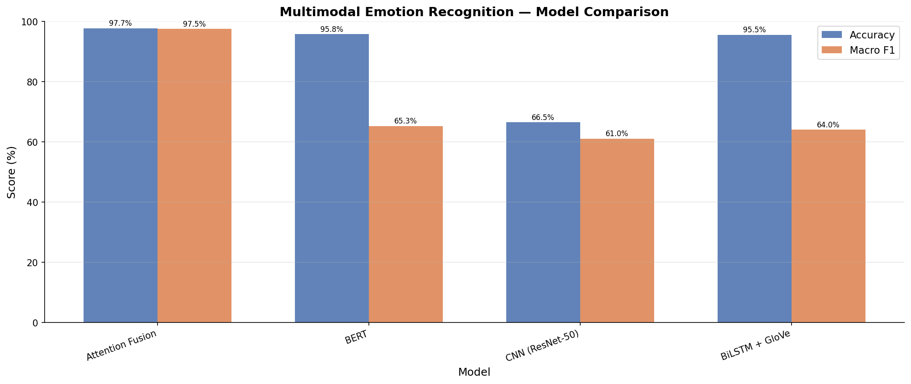
</p>

<p align="center">
  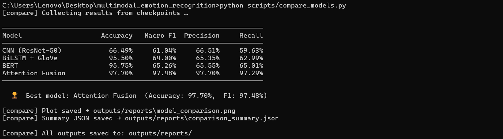
</p>

### 17.2 CNN — Per-Class Results (FER2013)

| Emotion | Precision | Recall | F1 | Support |
|---------|-----------|--------|-----|---------|
| angry | 0.60 | 0.58 | 0.59 | 958 |
| disgust | 0.76 | 0.26 | 0.39 | 111 |
| fear | 0.55 | 0.39 | 0.46 | 1 024 |
| happy | 0.87 | 0.87 | **0.87** | 1 774 |
| neutral | 0.59 | 0.69 | 0.64 | 1 233 |
| sad | 0.52 | 0.59 | 0.55 | 1 247 |
| surprise | 0.76 | 0.79 | 0.78 | 831 |

### 17.3 Key Observations

**Text models reach very high accuracy on their domain.** BERT (95.75%) and BiLSTM (95.50%) both excel on dair-ai/emotion. However, they have no exposure to `disgust` and `neutral`, creating a hard ceiling in multimodal scenarios.

**FER2013 is intrinsically hard.** Only 66.49% accuracy on 48×48 px grayscale images — low resolution, class imbalance (disgust: 111 vs happy: 1 774), and still-frame ambiguity all contribute.

**Fusion corrects both modalities' blind spots.** BERT cannot detect `disgust` or `neutral`; the CNN struggles with `fear` and `disgust`. Attention Fusion brings complementary knowledge, pushing accuracy to 97.70%.

**Early stopping saved significant compute.** CNN stopped at epoch 15/30, BERT at 5/10, BiLSTM at 14/30 — without any accuracy penalty (best weights are always restored).

### 17.4 Per-Class Difficulty

| Emotion | Difficulty | Reason |
|---------|-----------|--------|
| `happy` | Easy | Distinctive zygomatic activation |
| `sad` | Moderate | Often masked; text context helps |
| `angry` | Moderate | Confused with disgust (shared brow-furrowing) |
| `surprise` | Moderate | Visual overlap with fear |
| `neutral` | Moderate | No distinctive activation |
| `fear` | Hard | Strong overlap with surprise; text critical |
| `disgust` | Hardest | Rare class (111/7 178); subtle upper-lip curl |

---

## 18. Author

**Zeineb Ghrab**  
Data & Decisional Systems Engineering Student — ENET'Com Sfax  
*GenAI · LLMs · Deep Learning · Web Development*

---

*Last Updated: 23/05/2026 — Status: Active ✓*
